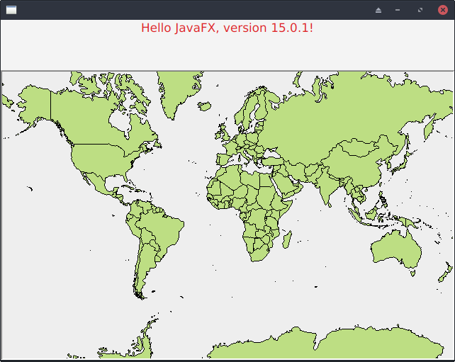

# Gluon Openmap Example

This Gluon Client sample was generated from https://start.gluon.io

We have a simple JavaFX form containing an Openmap map.
The Openmap code was borrowed from SimpleMap.main



## Quick instructions

Gluon:

    mvn clean client:build
    
or

    mvn clean package
    java -agentlib:native-image-agent=config-output-dir=META-INF -jar target/gluon-openamp-1.0.0-SNAPSHOT.jar
    native-image --no-fallback --verbose  -jar target/gluon-openamp-1.0.0-SNAPSHOT.jar
    
### Run the sample as a native image

    mvn client:build client:run


## Selected features

This is a list of all the features that were selected when creating the sample:

### JavaFX 15.0.1 Modules

 - javafx-base
 - javafx-graphics
 - javafx-controls
 - javafx-fxml

## Does not work!
native-image fails at runtime with

```
[paul@mxpc ~/dev/graalvm/gluon-openmap (master)]: ./map
Exception in Application start method
Exception in thread "main" java.lang.RuntimeException: Exception in Application start method
    at com.sun.javafx.application.LauncherImpl.launchApplication1(LauncherImpl.java:900)
    at com.sun.javafx.application.LauncherImpl.lambda$launchApplication$2(LauncherImpl.java:195)
    at java.lang.Thread.run(Thread.java:834)
    at com.oracle.svm.core.thread.JavaThreads.threadStartRoutine(JavaThreads.java:519)
    at com.oracle.svm.core.posix.thread.PosixJavaThreads.pthreadStartRoutine(PosixJavaThreads.java:192)
Caused by: java.lang.UnsatisfiedLinkError: no javafx_font in java.library.path
    at com.oracle.svm.core.jdk.NativeLibrarySupport.loadLibraryRelative(NativeLibrarySupport.java:132)
    at java.lang.ClassLoader.loadLibrary(ClassLoader.java:275)
    at java.lang.Runtime.loadLibrary0(Runtime.java:830)
    at java.lang.System.loadLibrary(System.java:1871)
    at com.sun.glass.utils.NativeLibLoader.loadLibraryInternal(NativeLibLoader.java:163)
    at com.sun.glass.utils.NativeLibLoader.loadLibrary(NativeLibLoader.java:53)
    at com.sun.javafx.font.PrismFontFactory.lambda$static$0(PrismFontFactory.java:98)
    at java.security.AccessController.doPrivileged(AccessController.java:84)
    at com.sun.javafx.font.PrismFontFactory.<clinit>(PrismFontFactory.java:96)
    at com.oracle.svm.core.classinitialization.ClassInitializationInfo.invokeClassInitializer(ClassInitializationInfo.java:375)
    at com.oracle.svm.core.classinitialization.ClassInitializationInfo.initialize(ClassInitializationInfo.java:295)
    at com.sun.javafx.text.PrismTextLayout.<clinit>(PrismTextLayout.java:66)
    at com.oracle.svm.core.classinitialization.ClassInitializationInfo.invokeClassInitializer(ClassInitializationInfo.java:375)
    at com.oracle.svm.core.classinitialization.ClassInitializationInfo.initialize(ClassInitializationInfo.java:295)
    at com.sun.javafx.text.PrismTextLayoutFactory.<clinit>(PrismTextLayoutFactory.java:33)
    at com.oracle.svm.core.classinitialization.ClassInitializationInfo.invokeClassInitializer(ClassInitializationInfo.java:375)
    at com.oracle.svm.core.classinitialization.ClassInitializationInfo.initialize(ClassInitializationInfo.java:295)
    at com.sun.javafx.tk.quantum.QuantumToolkit.getTextLayoutFactory(QuantumToolkit.java:1141)
    at com.sun.javafx.scene.control.skin.Utils.<clinit>(Utils.java:99)
    at com.oracle.svm.core.classinitialization.ClassInitializationInfo.invokeClassInitializer(ClassInitializationInfo.java:375)
    at com.oracle.svm.core.classinitialization.ClassInitializationInfo.initialize(ClassInitializationInfo.java:295)
    at com.sun.javafx.css.StyleManager.getURL(StyleManager.java:872)
    at com.sun.javafx.css.StyleManager.loadStylesheetUnPrivileged(StyleManager.java:1088)
    at com.sun.javafx.css.StyleManager.loadStylesheet(StyleManager.java:943)
    at com.sun.javafx.css.StyleManager._setDefaultUserAgentStylesheet(StyleManager.java:1391)
    at com.sun.javafx.css.StyleManager.setUserAgentStylesheets(StyleManager.java:1242)
    at com.sun.javafx.application.PlatformImpl.lambda$_setPlatformUserAgentStylesheet$20(PlatformImpl.java:849)
    at java.security.AccessController.doPrivileged(AccessController.java:84)
    at com.sun.javafx.application.PlatformImpl._setPlatformUserAgentStylesheet(PlatformImpl.java:848)
    at com.sun.javafx.application.PlatformImpl.setPlatformUserAgentStylesheet(PlatformImpl.java:693)
    at com.sun.javafx.application.PlatformImpl.setDefaultPlatformUserAgentStylesheet(PlatformImpl.java:657)
    at javafx.scene.control.Control.<clinit>(Control.java:99)
    at com.oracle.svm.core.classinitialization.ClassInitializationInfo.invokeClassInitializer(ClassInitializationInfo.java:375)
    at com.oracle.svm.core.classinitialization.ClassInitializationInfo.initialize(ClassInitializationInfo.java:295)
    at java.lang.Class.ensureInitialized(DynamicHub.java:530)
    at com.oracle.svm.core.classinitialization.ClassInitializationInfo.initialize(ClassInitializationInfo.java:260)
    at java.lang.Class.ensureInitialized(DynamicHub.java:530)
    at com.oracle.svm.core.classinitialization.ClassInitializationInfo.initialize(ClassInitializationInfo.java:260)
    at java.lang.Class.ensureInitialized(DynamicHub.java:530)
    at java.lang.Class.newInstance(DynamicHub.java:876)
    at javafx.fxml.FXMLLoader$InstanceDeclarationElement.constructValue(FXMLLoader.java:1021)
    at javafx.fxml.FXMLLoader$ValueElement.processStartElement(FXMLLoader.java:756)
    at javafx.fxml.FXMLLoader.processStartElement(FXMLLoader.java:2808)
    at javafx.fxml.FXMLLoader.loadImpl(FXMLLoader.java:2634)
    at javafx.fxml.FXMLLoader.loadImpl(FXMLLoader.java:2548)
    at javafx.fxml.FXMLLoader.loadImpl(FXMLLoader.java:3323)
    at javafx.fxml.FXMLLoader.loadImpl(FXMLLoader.java:3280)
    at javafx.fxml.FXMLLoader.loadImpl(FXMLLoader.java:3249)
    at javafx.fxml.FXMLLoader.loadImpl(FXMLLoader.java:3222)
    at javafx.fxml.FXMLLoader.load(FXMLLoader.java:3214)
    at uk.co.cloudswing.openmap.Loader.start(Loader.java:16)
    at com.sun.javafx.application.LauncherImpl.lambda$launchApplication1$9(LauncherImpl.java:846)
    at com.sun.javafx.application.PlatformImpl.lambda$runAndWait$12(PlatformImpl.java:455)
    at com.sun.javafx.application.PlatformImpl.lambda$runLater$10(PlatformImpl.java:428)
    at java.security.AccessController.doPrivileged(AccessController.java:102)
    at com.sun.javafx.application.PlatformImpl.lambda$runLater$11(PlatformImpl.java:427)
    at com.sun.glass.ui.InvokeLaterDispatcher$Future.run(InvokeLaterDispatcher.java:96)
    at com.oracle.svm.jni.JNIJavaCallWrappers.jniInvoke_VA_LIST:Ljava_lang_Runnable_2_0002erun_00028_00029V(JNIJavaCallWrappers.java:0)
    at com.sun.glass.ui.gtk.GtkApplication._runLoop(GtkApplication.java)
    at com.sun.glass.ui.gtk.GtkApplication.lambda$runLoop$11(GtkApplication.java:277)
    ... 3 more
```
With Gluon, linking fails
```
Fri Feb 05 09:54:25 GMT 2021][INFO] ==================== LINK TASK ====================
[Fri Feb 05 09:54:27 GMT 2021][INFO] [SUB] /usr/bin/ld: /media/paul/7BC262EF03F9976C/dev/graalvm/gluon-openmap/target/client/x86_64-linux/gvm/tmp/SVM-1612517897434/uk.co.cloudswing.openmap.main.o:(.data+0x20): undefined reference to `Java_com_sun_imageio_plugins_jpeg_JPEGImageReader_clearNativeReadAbortFlag'
[Fri Feb 05 09:54:27 GMT 2021][INFO] [SUB] /usr/bin/ld: /media/paul/7BC262EF03F9976C/dev/graalvm/gluon-openmap/target/client/x86_64-linux/gvm/tmp/SVM-1612517897434/uk.co.cloudswing.openmap.main.o:(.data+0x38): undefined reference to `JNI_OnLoad_fontmanager'
[Fri Feb 05 09:54:27 GMT 2021][INFO] [SUB] /usr/bin/ld: /media/paul/7BC262EF03F9976C/dev/graalvm/gluon-openmap/target/client/x86_64-linux/gvm/tmp/SVM-1612517897434/uk.co.cloudswing.openmap.main.o:(.data+0x108): undefined reference to `Java_java_awt_Font_initIDs'
[Fri Feb 05 09:54:27 GMT 2021][INFO] [SUB] /usr/bin/ld: /media/paul/7BC262EF03F9976C/dev/graalvm/gluon-openmap/target/client/x86_64-linux/gvm/tmp/SVM-1612517897434/uk.co.cloudswing.openmap.main.o:(.data+0x120): undefined reference to `Java_java_awt_image_BufferedImage_initIDs'
[Fri Feb 05 09:54:27 GMT 2021][INFO] [SUB] /usr/bin/ld: /media/paul/7BC262EF03F9976C/dev/graalvm/gluon-openmap/target/client/x86_64-linux/gvm/tmp/SVM-1612517897434/uk.co.cloudswing.openmap.main.o:(.data+0x270): undefined reference to `Java_com_sun_imageio_plugins_jpeg_JPEGImageReader_disposeReader'
[Fri Feb 05 09:54:27 GMT 2021][INFO] [SUB] /usr/bin/ld: /media/paul/7BC262EF03F9976C/dev/graalvm/gluon-openmap/target/client/x86_64-linux/gvm/tmp/SVM-1612517897434/uk.co.cloudswing.openmap.main.o:(.data+0x308): undefined reference to `JNI_OnLoad_awt'
[Fri Feb 05 09:54:27 GMT 2021][INFO] [SUB] /usr/bin/ld: /media/paul/7BC262EF03F9976C/dev/graalvm/gluon-openmap/target/client/x86_64-linux/gvm/tmp/SVM-1612517897434/uk.co.cloudswing.openmap.main.o:(.data+0x338): undefined reference to `Java_sun_java2d_pipe_ShapeSpanIterator_getPathBox'
[Fri Feb 05 09:54:27 GMT 2021][INFO] [SUB] /usr/bin/ld: /media/paul/7BC262EF03F9976C/dev/graalvm/gluon-openmap/target/client/x86_64-linux/gvm/tmp/SVM-1612517897434/uk.co.cloudswing.openmap.main.o:(.data+0x3b8): undefined reference to `Java_com_sun_imageio_plugins_jpeg_JPEGImageReader_setOutColorSpace'
[Fri Feb 05 09:54:27 GMT 2021][INFO] [SUB] /usr/bin/ld: /media/paul/7BC262EF03F9976C/dev/graalvm/gluon-openmap/target/client/x86_64-linux/gvm/tmp/SVM-1612517897434/uk.co.cloudswing.openmap.main.o:(.data+0x3f0): undefined reference to `Java_sun_java2d_cmm_lcms_LCMS_loadProfileNative'
[Fri Feb 05 09:54:27 GMT 2021][INFO] [SUB] /usr/bin/ld: /media/paul/7BC262EF03F9976C/dev/graalvm/gluon-openmap/target/client/x86_64-linux/gvm/tmp/SVM-1612517897434/uk.co.cloudswing.openmap.main.o:(.data+0x440): undefined reference to `Java_sun_java2d_cmm_lcms_LCMS_initLCMS'
[Fri Feb 05 09:54:27 GMT 2021][INFO] [SUB] /usr/bin/ld: /media/paul/7BC262EF03F9976C/dev/graalvm/gluon-openmap/target/client/x86_64-linux/gvm/tmp/SVM-1612517897434/uk.co.cloudswing.openmap.main.o:(.data+0x4b8): undefined reference to `Java_com_sun_imageio_plugins_jpeg_JPEGImageReader_initReaderIDs'
[Fri Feb 05 09:54:27 GMT 2021][INFO] [SUB] /usr/bin/ld: /media/paul/7BC262EF03F9976C/dev/graalvm/gluon-openmap/target/client/x86_64-linux/gvm/tmp/SVM-1612517897434/uk.co.cloudswing.openmap.main.o:(.data+0x4f0): undefined reference to `Java_java_awt_image_SinglePixelPackedSampleModel_initIDs'
[Fri Feb 05 09:54:27 GMT 2021][INFO] [SUB] /usr/bin/ld: /media/paul/7BC262EF03F9976C/dev/graalvm/gluon-openmap/target/client/x86_64-linux/gvm/tmp/SVM-1612517897434/uk.co.cloudswing.openmap.main.o:(.data+0x540): undefined reference to `Java_com_sun_imageio_plugins_jpeg_JPEGImageReader_initJPEGImageReader'
[Fri Feb 05 09:54:27 GMT 2021][INFO] [SUB] /usr/bin/ld: /media/paul/7BC262EF03F9976C/dev/graalvm/gluon-openmap/target/client/x86_64-linux/gvm/tmp/SVM-1612517897434/uk.co.cloudswing.openmap.main.o:(.data+0x618): undefined reference to `Java_java_awt_image_IndexColorModel_initIDs'
[Fri Feb 05 09:54:27 GMT 2021][INFO] [SUB] /usr/bin/ld: /media/paul/7BC262EF03F9976C/dev/graalvm/gluon-openmap/target/client/x86_64-linux/gvm/tmp/SVM-1612517897434/uk.co.cloudswing.openmap.main.o:(.data+0x620): undefined reference to `Java_com_sun_imageio_plugins_jpeg_JPEGImageReader_setSource'
[Fri Feb 05 09:54:27 GMT 2021][INFO] [SUB] /usr/bin/ld: /media/paul/7BC262EF03F9976C/dev/graalvm/gluon-openmap/target/client/x86_64-linux/gvm/tmp/SVM-1612517897434/uk.co.cloudswing.openmap.main.o:(.data+0x6c8): undefined reference to `Java_com_sun_imageio_plugins_jpeg_JPEGImageReader_readImage'
[Fri Feb 05 09:54:27 GMT 2021][INFO] [SUB] /usr/bin/ld: /media/paul/7BC262EF03F9976C/dev/graalvm/gluon-openmap/target/client/x86_64-linux/gvm/tmp/SVM-1612517897434/uk.co.cloudswing.openmap.main.o:(.data+0x6f0): undefined reference to `Java_com_sun_imageio_plugins_jpeg_JPEGImageReader_resetLibraryState'
[Fri Feb 05 09:54:27 GMT 2021][INFO] [SUB] /usr/bin/ld: /media/paul/7BC262EF03F9976C/dev/graalvm/gluon-openmap/target/client/x86_64-linux/gvm/tmp/SVM-1612517897434/uk.co.cloudswing.openmap.main.o:(.data+0x768): undefined reference to `Java_sun_java2d_pipe_ShapeSpanIterator_pathDone'
[Fri Feb 05 09:54:27 GMT 2021][INFO] [SUB] /usr/bin/ld: /media/paul/7BC262EF03F9976C/dev/graalvm/gluon-openmap/target/client/x86_64-linux/gvm/tmp/SVM-1612517897434/uk.co.cloudswing.openmap.main.o:(.data+0x7d8): undefined reference to `Java_sun_java2d_pipe_ShapeSpanIterator_setOutputAreaXYXY'
[Fri Feb 05 09:54:27 GMT 2021][INFO] [SUB] /usr/bin/ld: /media/paul/7BC262EF03F9976C/dev/graalvm/gluon-openmap/target/client/x86_64-linux/gvm/tmp/SVM-1612517897434/uk.co.cloudswing.openmap.main.o:(.data+0x8a8): undefined reference to `Java_sun_java2d_pipe_ShapeSpanIterator_nextSpan'
[Fri Feb 05 09:54:27 GMT 2021][INFO] [SUB] /usr/bin/ld: /media/paul/7BC262EF03F9976C/dev/graalvm/gluon-openmap/target/client/x86_64-linux/gvm/tmp/SVM-1612517897434/uk.co.cloudswing.openmap.main.o:(.data+0x910): undefined reference to `Java_sun_awt_image_ByteComponentRaster_initIDs'
[Fri Feb 05 09:54:27 GMT 2021][INFO] [SUB] /usr/bin/ld: /media/paul/7BC262EF03F9976C/dev/graalvm/gluon-openmap/target/client/x86_64-linux/gvm/tmp/SVM-1612517897434/uk.co.cloudswing.openmap.main.o:(.data+0x9b0): undefined reference to `Java_sun_awt_image_IntegerComponentRaster_initIDs'
[Fri Feb 05 09:54:27 GMT 2021][INFO] [SUB] /usr/bin/ld: /media/paul/7BC262EF03F9976C/dev/graalvm/gluon-openmap/target/client/x86_64-linux/gvm/tmp/SVM-1612517897434/uk.co.cloudswing.openmap.main.o:(.data+0x9c0): undefined reference to `Java_sun_font_SunLayoutEngine_disposeFace'
[Fri Feb 05 09:54:27 GMT 2021][INFO] [SUB] /usr/bin/ld: /media/paul/7BC262EF03F9976C/dev/graalvm/gluon-openmap/target/client/x86_64-linux/gvm/tmp/SVM-1612517897434/uk.co.cloudswing.openmap.main.o:(.data+0x9d0): undefined reference to `Java_sun_java2d_cmm_lcms_LCMS_createNativeTransform'
[Fri Feb 05 09:54:27 GMT 2021][INFO] [SUB] /usr/bin/ld: /media/paul/7BC262EF03F9976C/dev/graalvm/gluon-openmap/target/client/x86_64-linux/gvm/tmp/SVM-1612517897434/uk.co.cloudswing.openmap.main.o:(.data+0xab0): undefined reference to `Java_sun_java2d_cmm_lcms_LCMS_getTagNative'
[Fri Feb 05 09:54:27 GMT 2021][INFO] [SUB] /usr/bin/ld: /media/paul/7BC262EF03F9976C/dev/graalvm/gluon-openmap/target/client/x86_64-linux/gvm/tmp/SVM-1612517897434/uk.co.cloudswing.openmap.main.o:(.data+0xac0): undefined reference to `Java_sun_awt_image_BytePackedRaster_initIDs'
[Fri Feb 05 09:54:27 GMT 2021][INFO] [SUB] /usr/bin/ld: /media/paul/7BC262EF03F9976C/dev/graalvm/gluon-openmap/target/client/x86_64-linux/gvm/tmp/SVM-1612517897434/uk.co.cloudswing.openmap.main.o:(.data+0xaf0): undefined reference to `JNI_OnLoad_awt_headless'
[Fri Feb 05 09:54:27 GMT 2021][INFO] [SUB] /usr/bin/ld: /media/paul/7BC262EF03F9976C/dev/graalvm/gluon-openmap/target/client/x86_64-linux/gvm/tmp/SVM-1612517897434/uk.co.cloudswing.openmap.main.o:(.data+0xb00): undefined reference to `Java_sun_java2d_pipe_ShapeSpanIterator_dispose'
[Fri Feb 05 09:54:27 GMT 2021][INFO] [SUB] /usr/bin/ld: /media/paul/7BC262EF03F9976C/dev/graalvm/gluon-openmap/target/client/x86_64-linux/gvm/tmp/SVM-1612517897434/uk.co.cloudswing.openmap.main.o:(.data+0xb68): undefined reference to `Java_com_sun_imageio_plugins_jpeg_JPEGImageReader_readImageHeader'
[Fri Feb 05 09:54:27 GMT 2021][INFO] [SUB] /usr/bin/ld: /media/paul/7BC262EF03F9976C/dev/graalvm/gluon-openmap/target/client/x86_64-linux/gvm/tmp/SVM-1612517897434/uk.co.cloudswing.openmap.main.o:(.data+0xb78): undefined reference to `Java_sun_awt_image_ShortComponentRaster_initIDs'
[Fri Feb 05 09:54:27 GMT 2021][INFO] [SUB] /usr/bin/ld: /media/paul/7BC262EF03F9976C/dev/graalvm/gluon-openmap/target/client/x86_64-linux/gvm/tmp/SVM-1612517897434/uk.co.cloudswing.openmap.main.o:(.data+0xbb0): undefined reference to `Java_sun_java2d_pipe_ShapeSpanIterator_addSegment'
[Fri Feb 05 09:54:27 GMT 2021][INFO] [SUB] /usr/bin/ld: /media/paul/7BC262EF03F9976C/dev/graalvm/gluon-openmap/target/client/x86_64-linux/gvm/tmp/SVM-1612517897434/uk.co.cloudswing.openmap.main.o:(.data+0xbc0): undefined reference to `Java_com_sun_imageio_plugins_jpeg_JPEGImageReader_resetReader'
[Fri Feb 05 09:54:27 GMT 2021][INFO] [SUB] /usr/bin/ld: /media/paul/7BC262EF03F9976C/dev/graalvm/gluon-openmap/target/client/x86_64-linux/gvm/tmp/SVM-1612517897434/uk.co.cloudswing.openmap.main.o:(.data+0xc28): undefined reference to `Java_java_awt_image_SampleModel_initIDs'
[Fri Feb 05 09:54:27 GMT 2021][INFO] [SUB] /usr/bin/ld: /media/paul/7BC262EF03F9976C/dev/graalvm/gluon-openmap/target/client/x86_64-linux/gvm/tmp/SVM-1612517897434/uk.co.cloudswing.openmap.main.o:(.data+0xc48): undefined reference to `Java_sun_java2d_pipe_Region_initIDs'
[Fri Feb 05 09:54:27 GMT 2021][INFO] [SUB] /usr/bin/ld: /media/paul/7BC262EF03F9976C/dev/graalvm/gluon-openmap/target/client/x86_64-linux/gvm/tmp/SVM-1612517897434/uk.co.cloudswing.openmap.main.o:(.data+0xc90): undefined reference to `JNI_OnLoad_lcms'
[Fri Feb 05 09:54:27 GMT 2021][INFO] [SUB] /usr/bin/ld: /media/paul/7BC262EF03F9976C/dev/graalvm/gluon-openmap/target/client/x86_64-linux/gvm/tmp/SVM-1612517897434/uk.co.cloudswing.openmap.main.o:(.data+0xca8): undefined reference to `Java_sun_font_SunFontManager_initIDs'
[Fri Feb 05 09:54:27 GMT 2021][INFO] [SUB] /usr/bin/ld: /media/paul/7BC262EF03F9976C/dev/graalvm/gluon-openmap/target/client/x86_64-linux/gvm/tmp/SVM-1612517897434/uk.co.cloudswing.openmap.main.o:(.data+0xd48): undefined reference to `Java_sun_font_StrikeCache_getGlyphCacheDescription'
[Fri Feb 05 09:54:27 GMT 2021][INFO] [SUB] /usr/bin/ld: /media/paul/7BC262EF03F9976C/dev/graalvm/gluon-openmap/target/client/x86_64-linux/gvm/tmp/SVM-1612517897434/uk.co.cloudswing.openmap.main.o:(.data+0xd50): undefined reference to `Java_java_awt_image_ColorModel_initIDs'
[Fri Feb 05 09:54:27 GMT 2021][INFO] [SUB] /usr/bin/ld: /media/paul/7BC262EF03F9976C/dev/graalvm/gluon-openmap/target/client/x86_64-linux/gvm/tmp/SVM-1612517897434/uk.co.cloudswing.openmap.main.o:(.data+0xd60): undefined reference to `Java_sun_java2d_cmm_lcms_LCMS_getProfileID'
[Fri Feb 05 09:54:27 GMT 2021][INFO] [SUB] /usr/bin/ld: /media/paul/7BC262EF03F9976C/dev/graalvm/gluon-openmap/target/client/x86_64-linux/gvm/tmp/SVM-1612517897434/uk.co.cloudswing.openmap.main.o:(.data+0xd68): undefined reference to `Java_sun_java2d_cmm_lcms_LCMS_colorConvert'
[Fri Feb 05 09:54:27 GMT 2021][INFO] [SUB] /usr/bin/ld: /media/paul/7BC262EF03F9976C/dev/graalvm/gluon-openmap/target/client/x86_64-linux/gvm/tmp/SVM-1612517897434/uk.co.cloudswing.openmap.main.o:(.data+0xfd8): undefined reference to `Java_java_awt_Toolkit_initIDs'
[Fri Feb 05 09:54:27 GMT 2021][INFO] [SUB] /usr/bin/ld: /media/paul/7BC262EF03F9976C/dev/graalvm/gluon-openmap/target/client/x86_64-linux/gvm/tmp/SVM-1612517897434/uk.co.cloudswing.openmap.main.o:(.data+0x1008): undefined reference to `JNI_OnLoad_javajpeg'
[Fri Feb 05 09:54:27 GMT 2021][INFO] [SUB] /usr/bin/ld: /media/paul/7BC262EF03F9976C/dev/graalvm/gluon-openmap/target/client/x86_64-linux/gvm/tmp/SVM-1612517897434/uk.co.cloudswing.openmap.main.o:(.data+0x1010): undefined reference to `Java_sun_java2d_pipe_ShapeSpanIterator_setRule'
[Fri Feb 05 09:54:27 GMT 2021][INFO] [SUB] /usr/bin/ld: /media/paul/7BC262EF03F9976C/dev/graalvm/gluon-openmap/target/client/x86_64-linux/gvm/tmp/SVM-1612517897434/uk.co.cloudswing.openmap.main.o:(.data+0x1048): undefined reference to `Java_sun_java2d_pipe_ShapeSpanIterator_initIDs'
[Fri Feb 05 09:54:27 GMT 2021][INFO] [SUB] /usr/bin/ld: /media/paul/7BC262EF03F9976C/dev/graalvm/gluon-openmap/target/client/x86_64-linux/gvm/tmp/SVM-1612517897434/uk.co.cloudswing.openmap.main.o:(.data+0x10a0): undefined reference to `Java_sun_java2d_pipe_ShapeSpanIterator_setNormalize'
[Fri Feb 05 09:54:27 GMT 2021][INFO] [SUB] /usr/bin/ld: /media/paul/7BC262EF03F9976C/dev/graalvm/gluon-openmap/target/client/x86_64-linux/gvm/tmp/SVM-1612517897434/uk.co.cloudswing.openmap.main.o:(.data+0x10c0): undefined reference to `Java_java_awt_image_Raster_initIDs'
[Fri Feb 05 09:54:27 GMT 2021][INFO] [SUB] /usr/bin/ld: /media/paul/7BC262EF03F9976C/dev/graalvm/gluon-openmap/target/client/x86_64-linux/gvm/tmp/SVM-1612517897434/uk.co.cloudswing.openmap.main.o:(.data+0x10c8): undefined reference to `Java_sun_java2d_Disposer_initIDs'
[Fri Feb 05 09:54:27 GMT 2021][INFO] [SUB] collect2: error: ld returned 1 exit status
[Fri Feb 05 09:54:27 GMT 2021][SEVERE] Process link failed with result: 1
Check the log files under /media/paul/7BC262EF03F9976C/dev/graalvm/gluon-openmap/target/client/x86_64-linux/gvm/log
And please check https://docs.gluonhq.com/client/ for more information.
[Fri Feb 05 09:54:27 GMT 2021][INFO] Logging process [link] to file: /media/paul/7BC262EF03F9976C/dev/graalvm/gluon-openmap/target/client/log/process-link-1612518867074.log
[Fri Feb 05 09:54:27 GMT 2021][SEVERE] Linking failed.
Check the log files under /media/paul/7BC262EF03F9976C/dev/graalvm/gluon-openmap/target/client/x86_64-linux/gvm/log
And please check https://docs.gluonhq.com/client/ for more information.
             _______  ___      __   __  _______  __    _
            |       ||   |    |  | |  ||       ||  |  | |
            |    ___||   |    |  | |  ||   _   ||   |_| |
            |   | __ |   |    |  |_|  ||  | |  ||       |
            |   ||  ||   |___ |       ||  |_|  ||  _    |
            |   |_| ||       ||       ||       || | |   |
            |_______||_______||_______||_______||_|  |__|

    Access to the latest docs, tips and tricks and more info on
    how to get support? Register your usage of Gluon Substrate now at
```
